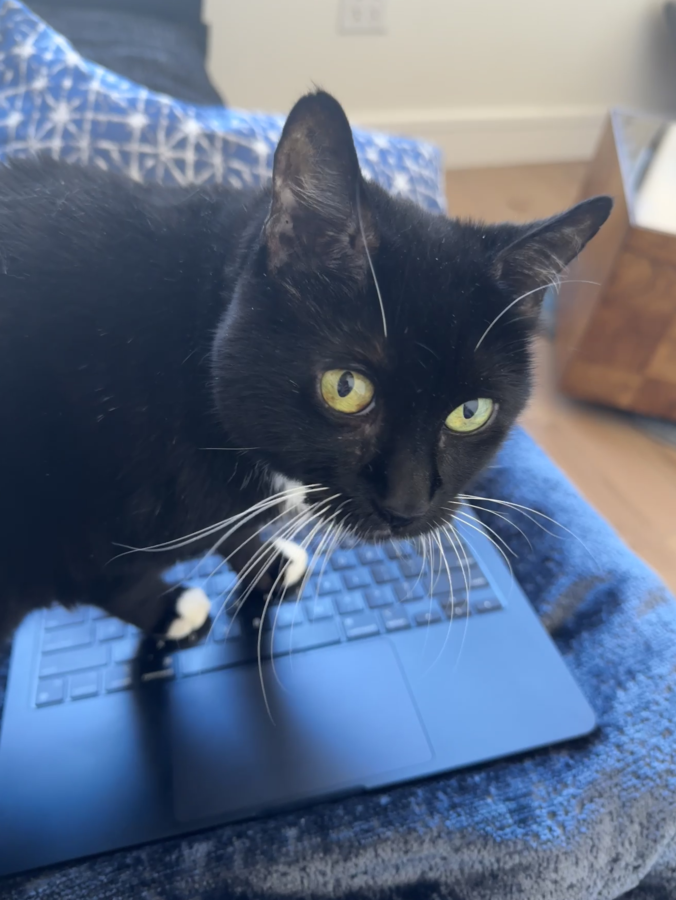

# Pawse v1.0.0 - Initial Release

Pawse is a macOS menu bar application that protects your keyboard from curious cats by detecting when they walk on it, playing a meow sound, and temporarily blocking keystrokes.

## Features
- 🐱 Detects cat typing patterns (multiple adjacent keys and rapid typing)
- 🔒 Blocks keystrokes for 3 seconds when cat typing is detected
- 🔊 Plays a meow sound alert
- 📊 Keeps track of daily cat visits
- 🎯 Simple menu bar controls

## Installation Instructions

1. Download `Pawse.app` from this release
2. Move `Pawse.app` to your Applications folder
3. Open System Settings > Privacy & Security
4. Grant the following permissions to Pawse:
   - **Accessibility**: System Settings > Privacy & Security > Accessibility
   - **Input Monitoring**: System Settings > Privacy & Security > Input Monitoring
5. Launch Pawse from your Applications folder

## First Run
- When you first launch Pawse, you'll be prompted to grant permissions
- Follow the prompts to open System Settings
- Make sure both Accessibility and Input Monitoring permissions are checked
- Restart Pawse after granting permissions

## Usage
- Click the paw icon in the menu bar to access controls
- Toggle sound alerts and keystroke blocking on/off
- View your cat's visit count for the day

## Requirements
- macOS 10.14 or later
- Required permissions (Accessibility and Input Monitoring)

## Known Limitations
- Requires both Accessibility and Input Monitoring permissions to function
- Sound playback requires system volume to be on
- Keystroke blocking may not work in some full-screen applications

## Troubleshooting
If the app isn't working:
1. Check that both permissions are granted
2. Try removing and re-adding the permissions
3. Restart the application
4. Make sure your system volume is on for sound alerts

## Support
If you encounter any issues, please:
1. Check the [README](https://github.com/dengshuyan/pawse/blob/main/README.md) for detailed instructions
2. Open an issue on GitHub if you need help

## Credits
- Meow sound from SOUND_GARAGE
- Special thanks to all the cats who helped test this application

---

Enjoy using Pawse! 🐱⌨️